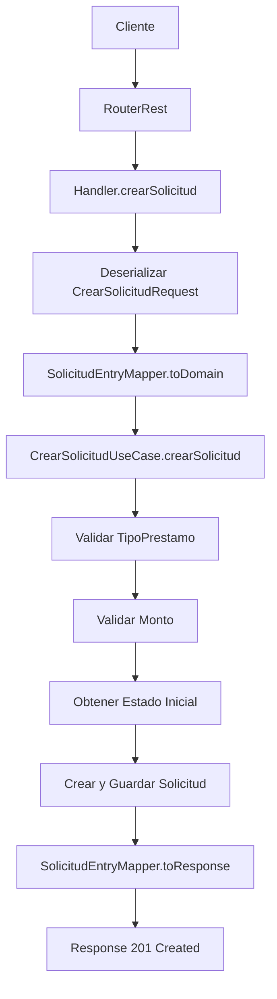

# Endpoint POST /api/v1/solicitud

## 📋 Descripción

Endpoint para crear una nueva solicitud de préstamo en el sistema CrediYa.

## 🔌 Especificación del Endpoint

### URL
```
POST /api/v1/solicitud
```

### Headers Requeridos
```
Content-Type: application/json
```

### Request Body
```json
{
  "montoSolicitado": 5000000.00,
  "plazoMeses": 24,
  "emailSolicitante": "cliente@ejemplo.com",
  "idTipoPrestamo": "550e8400-e29b-41d4-a716-446655440000"
}
```

#### Campos del Request
| Campo | Tipo | Requerido | Descripción | Validaciones |
|-------|------|-----------|-------------|--------------|
| `montoSolicitado` | BigDecimal | Sí | Monto del préstamo solicitado | Mínimo: $100,000.00 |
| `plazoMeses` | Integer | Sí | Plazo en meses del préstamo | Rango: 1-120 meses |
| `emailSolicitante` | String | Sí | Email del solicitante | Formato de email válido |
| `idTipoPrestamo` | UUID | Sí | ID del tipo de préstamo | Debe existir en el sistema |

### Response (201 Created)
```json
{
  "id": "550e8400-e29b-41d4-a716-446655440001",
  "montoSolicitado": 5000000.00,
  "plazoMeses": 24,
  "emailSolicitante": "cliente@ejemplo.com",
  "estadoSolicitud": "PENDIENTE_REVISION",
  "idTipoPrestamo": "550e8400-e29b-41d4-a716-446655440000",
  "fechaCreacion": "2024-01-15T10:30:00"
}
```

### Códigos de Respuesta
| Código | Descripción | Cuándo |
|--------|-------------|--------|
| 201 | Created | Solicitud creada exitosamente |
| 400 | Bad Request | Datos de entrada inválidos |
| 409 | Conflict | Tipo de préstamo no existe o monto fuera de rango |
| 500 | Internal Server Error | Error interno del servidor |

## 🏗️ Arquitectura

### Componentes Involucrados

1. **RouterRest.java** - Define la ruta del endpoint
2. **Handler.java** - Maneja la lógica del endpoint
3. **CrearSolicitudRequest.java** - DTO de entrada
4. **SolicitudResponse.java** - DTO de salida
5. **SolicitudEntryMapper.java** - Mapeo entre DTOs y dominio
6. **CrearSolicitudUseCase.java** - Caso de uso del dominio
7. **GlobalErrorHandler.java** - Manejo global de errores

### Flujo de Ejecución



## 🔒 Reglas de Negocio

### Validaciones Implementadas

1. **Validación de Tipo de Préstamo**
   - El tipo de préstamo debe existir en el sistema
   - Error: "El tipo de préstamo con ID {id} no existe"

2. **Validación de Monto**
   - El monto debe estar dentro del rango permitido para el tipo de préstamo
   - Error: "El monto $X no está dentro del rango permitido para el tipo de préstamo '{nombre}'"

3. **Validación de Estado Inicial**
   - El estado "Pendiente de revisión" debe estar disponible
   - Error: "El estado inicial 'Pendiente de revisión' no está disponible en el sistema"

### Estados de Solicitud

- **PENDIENTE_REVISION**: Estado inicial asignado automáticamente

## 🧪 Testing

### Casos de Prueba Recomendados

1. **Caso Exitoso**
   - Datos válidos → 201 Created

2. **Validaciones de Entrada**
   - Monto negativo → 400 Bad Request
   - Plazo inválido → 400 Bad Request
   - Email inválido → 400 Bad Request
   - UUID inválido → 400 Bad Request

3. **Validaciones de Negocio**
   - Tipo de préstamo inexistente → 409 Conflict
   - Monto fuera de rango → 409 Conflict
   - Estado inicial no disponible → 409 Conflict

### Ejemplo de Test con WebTestClient

```java
@Test
void deberiaCrearSolicitudExitosamente() {
    CrearSolicitudRequest request = CrearSolicitudRequest.builder()
        .montoSolicitado(BigDecimal.valueOf(5000000))
        .plazoMeses(24)
        .emailSolicitante("cliente@ejemplo.com")
        .idTipoPrestamo(UUID.randomUUID())
        .build();
        
    webTestClient.post()
        .uri("/api/v1/solicitud")
        .contentType(MediaType.APPLICATION_JSON)
        .bodyValue(request)
        .exchange()
        .expectStatus().isCreated()
        .expectBody(SolicitudResponse.class)
        .value(response -> {
            assertThat(response.id()).isNotNull();
            assertThat(response.estadoSolicitud()).isEqualTo("PENDIENTE_REVISION");
        });
}
```

## 📝 Notas de Implementación

### Características Técnicas

- **Programación Reactiva**: Uso completo de WebFlux y Project Reactor
- **Arquitectura Hexagonal**: Separación clara entre capas
- **Manejo de Errores**: Global y consistente
- **Logging**: Estructurado para observabilidad
- **Validaciones**: Bean Validation + validaciones de dominio

### Dependencias Requeridas

- Spring WebFlux
- Project Reactor
- Lombok (para DTOs)
- Jackson (para serialización JSON)

### Configuraciones Necesarias

1. **ObjectMapper**: Configurado para manejo de fechas y UUIDs
2. **Error Handler**: Global para capturar excepciones no manejadas
3. **CORS**: Configurado para permitir requests desde frontend

## 🔄 Próximos Pasos

1. **Implementar Autenticación**: Validación de JWT tokens
2. **Agregar Autorización**: Validación de roles (Cliente)
3. **Implementar Idempotencia**: Header X-Idempotency-Key
4. **Agregar Métricas**: Contadores de solicitudes creadas
5. **Implementar Eventos**: Publicación a SQS para notificaciones
6. **Agregar Tests**: Cobertura completa de casos de uso
